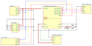
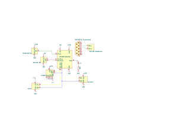
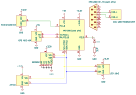
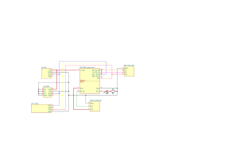

# Schematic Exports

This folder contains all exported versions of the [schematic](../kicad.kicad_sch) and its variants:

<table>
  <tr>
    <td width="50%"></td>
    <td width="50%"></td>
  </tr>
  <tr>
    <td rowspan="2"><b><a href="./kicad.svg">Original [svg]</a></b> (directly exported from KiCad)</td>
    <td><b><a href="./kicad_fit_content.svg">Modified [svg]</a></b> (fit to content, w/ background color)</td>
  </tr>
  <tr>
    <td><b><a href="./kicad_fit_content.pdf">Modified [pdf]</a></b> (fit to content)</td>
  </tr>
</table>

## Why these variants?

- **[`kicad.svg`](./kicad.svg):** Kept as the source. The other variants are derived from it.
- **[`kicad_fit_content.svg`](./kicad_fit_content.svg):** Cropped and styled to render correctly in Markdown files and in the [Typst report](../../../docs/report/technical_report.typ).
- **[`kicad_fit_content.pdf`](./kicad_fit_content.pdf):** LaTeX cannot render SVGs but is able to embed and render PDFs natively without quality loss.

If the schematic undergoes a major revision, we will explicitly export and commit a new snapshot here so the change history remains easy to follow.

## Snapshots

### v2 (21-06-2026)

**Replaced after:** the teacher's feedback on the schematic, which alerted us the LED's polarity was reversed.

<b>v2</b> Schematics Gallery

<table>
  <tr>
    <td width="50%"></td>
    <td width="50%"></td>
  </tr>
  <tr>
    <td rowspan="2"><b><a href="./snapshots/v2_21-06-2026/kicad.svg">v1 Original [svg]</a></b></td>
    <td><b><a href="./snapshots/v2_21-06-2026/kicad_fit_content.svg">v1 Modified [svg]</a></b></td>
  </tr>
  <tr>
    <td><b><a href="./snapshots/v2_21-06-2026/kicad_fit_content.pdf">v1 Modified [pdf]</a></b></td>
  </tr>
</table>

### v1 (17-06-2026)

**Replaced after reading:** [rules and guidelines for drawing good schematics](https://electronics.stackexchange.com/questions/28251/rules-and-guidelines-for-drawing-good-schematics), which prompted improvements to the layout and readability.

<b>v1</b> Schematics Gallery

<table>
  <tr>
    <td width="50%"></td>
    <td width="50%"></td>
  </tr>
  <tr>
    <td rowspan="2"><b><a href="./snapshots/v1_17-06-2026/kicad.svg">v1 Original [svg]</a></b></td>
    <td><b><a href="./snapshots/v1_17-06-2026/kicad_fit_content.svg">v1 Modified [svg]</a></b></td>
  </tr>
  <tr>
    <td><b><a href="./snapshots/v1_17-06-2026/kicad_fit_content.pdf">v1 Modified [pdf]</a></b></td>
  </tr>
</table>

